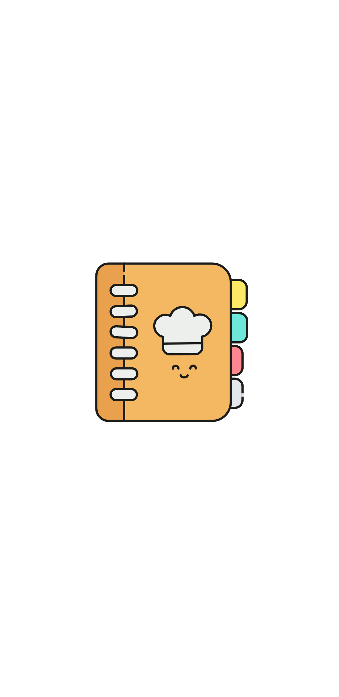
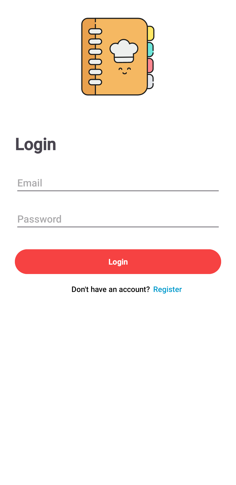
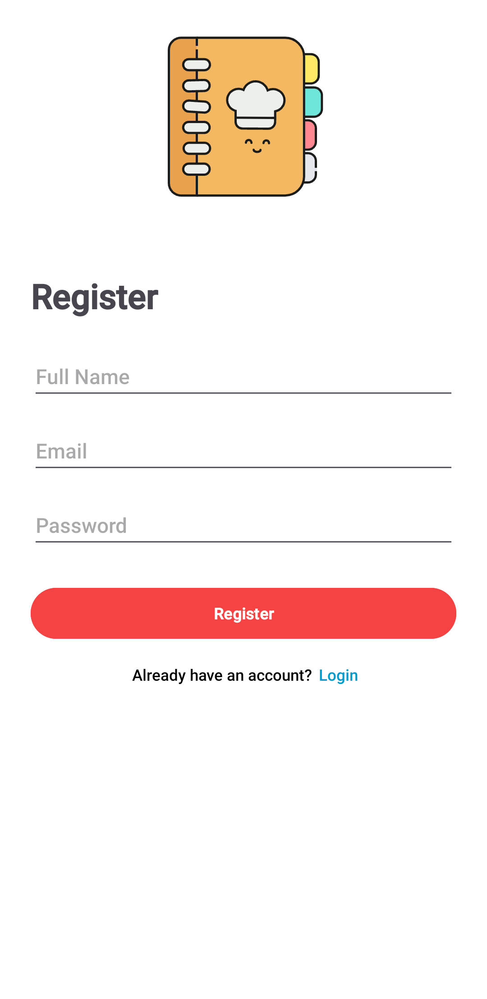
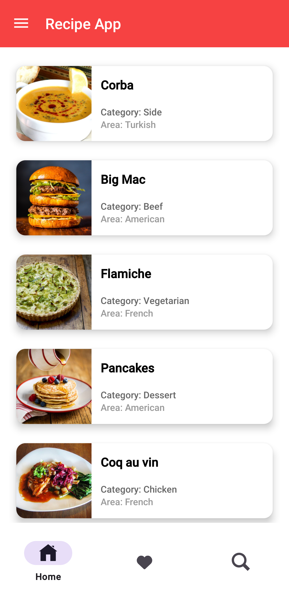
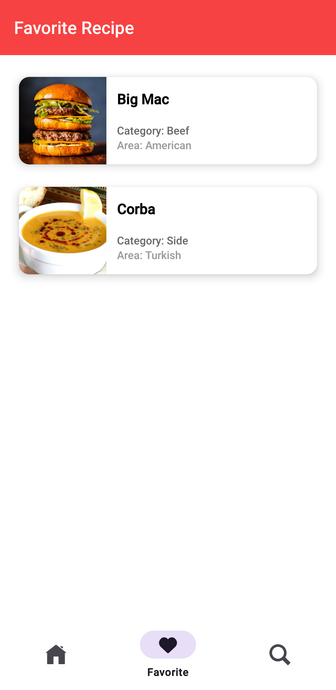
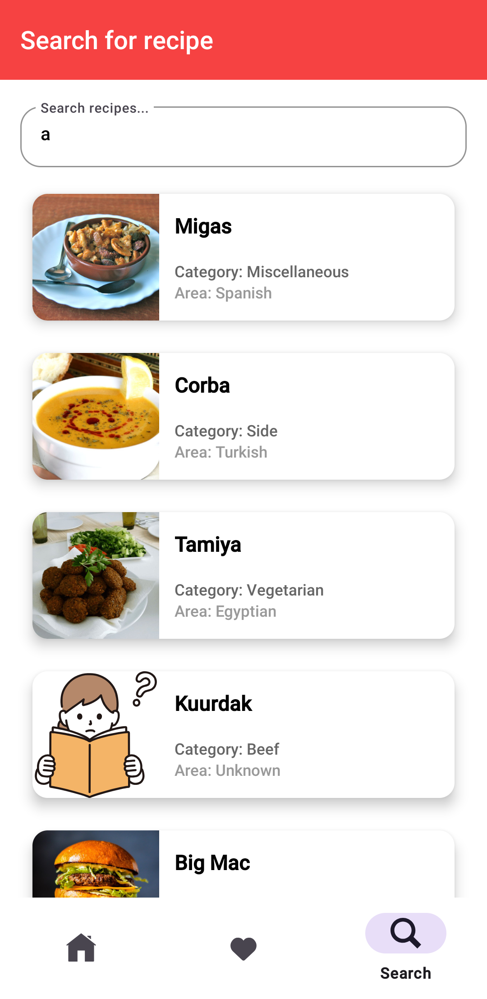

# Recipe App (Final Summer Course Project)

Android recipe application built using **Kotlin** as part of the **ITI summer training program** (final graduation project). The app offers user authentication, search, recipe details, and favorites, all presented in a responsive and clean interface.

## 📱 Screenshots

| Splash | Login | Register |
|--------|-------|----------|
|  |  |  |

| Home | Favorites | Search |
|------|-----------|--------|
|  |  |  |

## 🚀 Key Features
- Register and Login functionality
- Browse recipes by category and cuisine (sourced from TheMealDB API)
- View detailed recipe information, including ingredients and instructions
- Add and view favorite recipes (with local persistence)
- Search recipes by keyword
- Navigation via drawer (Logout, Delete Account) and bottom tabs

## 🧰 Tech Stack
- **Kotlin** for Android native development  
- **MVVM** architecture for scalable code structure  
- **Retrofit** for network communication  
- **Room Database** for local data storage  
- **Material Design**, **Navigation Component**, **LiveData**, and **ViewModel**

## 🔎 How the App Works

The app is designed with simplicity and functionality in mind. Here's how users interact with it:

1. **User Authentication**  
   New users can register with their name, email, and password. Returning users can log in securely.

2. **Browsing Recipes**  
   Once logged in, users land on a home screen listing meals. Each card shows the meal name, category, and origin.

3. **Recipe Details**  
   Tapping a meal opens a detailed view, including ingredients, instructions, and an image. Users can favorite the recipe from here.

4. **Search Functionality**  
   The search tab allows users to filter meals by name in real time using TheMealDB API.

5. **Favorites Management**  
   Users can mark meals as favorites and revisit them anytime from the favorites tab even offline.

6. **Drawer Menu**  
   Includes options for logging out or deleting the account.

## 🛠 Running the App Locally
1. Clone this branch:
    ```bash
   git clone https://github.com/MGehad/final_summer_course.git
   cd final_summer_course
   git checkout mohamed_gehad_hussien
    
2. Open the project in **Android Studio**
3. Build the project and sync Gradle
4. Run on emulator or real device (internet required)

## ℹ️ Notes

* Internet connection is needed to fetch recipes via TheMealDB API
* No API key is required—it uses public endpoints
* Tested on Android 10 and above

## 📬 Contact & Links

**Mohamed Gehad** — Mobile Apps Developer and ITI Summer Intern Graduate
* Email: [engmgehad@gmail.com](mailto:engmgehad@gmail.com)
* LinkedIn: [https://www.linkedin.com/in/mgehad](https://www.linkedin.com/in/mgehad)
* GitHub Repo: [https://github.com/MGehad/final\_summer\_course/tree/mohamed\_gehad\_hussien](https://github.com/MGehad/final_summer_course/tree/mohamed_gehad_hussien)
